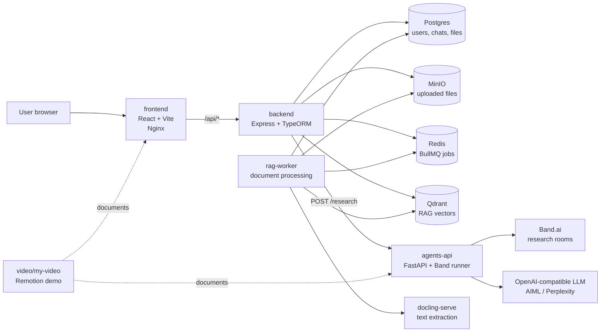
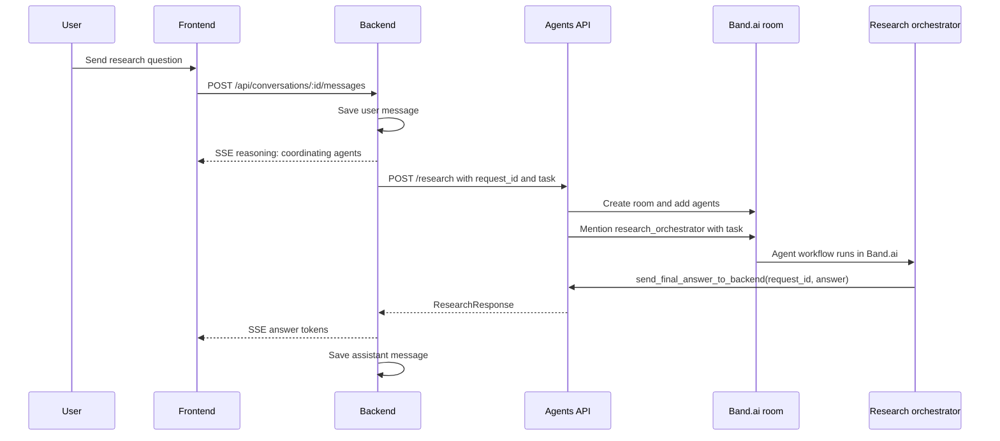

# JointSearch

## Demo


JointSearch is a deep-research chat application. A user asks a question in the
web UI, the backend creates a long-running research request, the agents service
coordinates a Band.ai research room, and the final answer is streamed back into
the chat.

The repository also contains the RAG ingestion pipeline and a Remotion explainer
video for the product.

## System Overview



## Services

| Path              | Service                        | Purpose                                                                        |
| ----------------- | ------------------------------ | ------------------------------------------------------------------------------ |
| `frontend/`       | React/Vite app served by Nginx | Chat UI, auth pages, knowledge-base UI                                         |
| `backend/`        | Express/TypeScript API         | Auth, conversations, SSE streaming, files, RAG search, agents API client       |
| `agents/`         | FastAPI + Band agent runner    | Creates Band.ai research rooms and runs orchestrator/planner/researcher agents |
| `rag-worker/`     | BullMQ worker                  | Extracts uploaded documents, chunks text, embeds chunks, writes Qdrant points  |
| `video/my-video/` | Remotion composition           | Product explainer video for the JointSearch workflow                           |

## Quick Start

From the repository root:

```bash
cp .env.example .env
cp agents/agent_config.example.yaml agents/agent_config.yaml
docker compose up --build
```

Before the full stack can run, edit `.env` and `agents/agent_config.yaml`:

- Set strong `JWT_SECRET` and `JWT_REFRESH_SECRET` values.
- Set `EMBEDDING_API_KEY` for the RAG embedding provider.
- Set `OPENAI_API_KEY` and `OPENAI_BASE_URL` for the agents LLM.
- Set `BAND_AGENT_API_KEY`, `BAND_AGENT_API_ID`, `BAND_REST_URL`, and
  `BAND_WS_URL`.
- Fill `agents/agent_config.yaml` with the Band.ai agent IDs and API keys for
  `research_orchestrator`, `research_planner`, `medior`, and the researchers.

The Docker stack publishes only the frontend:

```text
http://localhost
```

Nginx proxies `/api/*` to the backend inside the Compose network. Backend,
agents, Redis, Postgres, MinIO, Qdrant, and Docling are internal services.

## Main Research Flow



## Local Development

Run service-specific commands from each package directory.

```bash
# Frontend
cd frontend
npm install
npm run dev

# Backend
cd backend
npm install
npm run dev

# RAG worker
cd rag-worker
npm install
npm run dev

# Agents API and Band runner
cd agents
uv sync
uv run uvicorn agents.api:app --host 0.0.0.0 --port 8001

# Remotion video
cd video/my-video
npm install
npm run dev
```

The standalone Band runner can also be started from `agents/`:

```bash
uv run python -m agents.main
```

## Quality Gates

Use the gates that match the area you changed:

```bash
# frontend
cd frontend && npm run build && npm run lint

# backend
cd backend && npm run build && npm run lint

# rag-worker
cd rag-worker && npm run build

# agents
cd agents
uv run ruff format --check .
uv run ruff check .
uv run pyright .
uv run pytest

# video
cd video/my-video && npm run lint
```

## More Documentation

- [Project documentation](documentation.md) covers architecture, data flow,
  agent collaboration, RAG indexing, and operational notes.
- [Agents README](agents/README.md) covers the FastAPI agents service and Band.ai
  runtime.
- [Remotion video README](video/my-video/README.md) covers the demo composition
  and render workflow.
