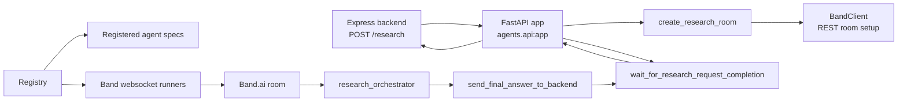
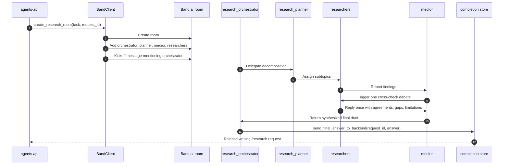

# JointSearch Agents

This package contains the backend-facing agents API and the local Band.ai agent
runtime. It is a Python 3.13 project managed with `uv`.

## Architecture



## Agent Room Flow



## Main Modules

| File                                         | Purpose                                                                  |
| -------------------------------------------- | ------------------------------------------------------------------------ |
| `src/agents/api.py`                          | FastAPI app, `/health`, `/research`, lifespan runner startup             |
| `src/agents/main.py`                         | Standalone Band runner entrypoint                                        |
| `src/agents/research_room.py`                | Room participant selection, kickoff message, Band room creation          |
| `src/agents/research_request_completions.py` | In-process wait/complete store for long-running backend requests         |
| `src/agents/band/client.py`                  | REST client wrapper for Band room/message operations                     |
| `src/agents/band/registry.py`                | Agent decorator, config loading, prompt construction, runner supervision |
| `src/agents/definitions/`                    | Agent roles and tools                                                    |

## Configuration

For local runs:

```bash
cp .env.example .env
cp agent_config.example.yaml agent_config.yaml
```

Required values:

- `BAND_REST_URL`
- `BAND_WS_URL`
- `BAND_AGENT_API_KEY`
- `BAND_AGENT_API_ID`
- `OPENAI_BASE_URL`
- `OPENAI_API_KEY`
- `AGENTS_RESEARCH_TIMEOUT_SECONDS`

`agent_config.yaml` must contain Band.ai agent IDs and API keys for:

- `research_orchestrator`
- `research_planner`
- `medior`
- `researcher_1`
- `researcher_2`
- `researcher_3`

Do not commit real credentials.

## Running

Run the backend-facing FastAPI service and Band runner together:

```bash
uv sync
uv run uvicorn agents.api:app --host 0.0.0.0 --port 8001
```

Run only the Band agent runner:

```bash
uv run python -m agents.main
```

Manually create a research room for a smoke test:

```bash
uv run python -m agents.research_room "Research the current state of AI coding agents."
```

## Quality Gates

```bash
uv run ruff format --check .
uv run ruff check .
uv run pyright .
uv run pytest
```
