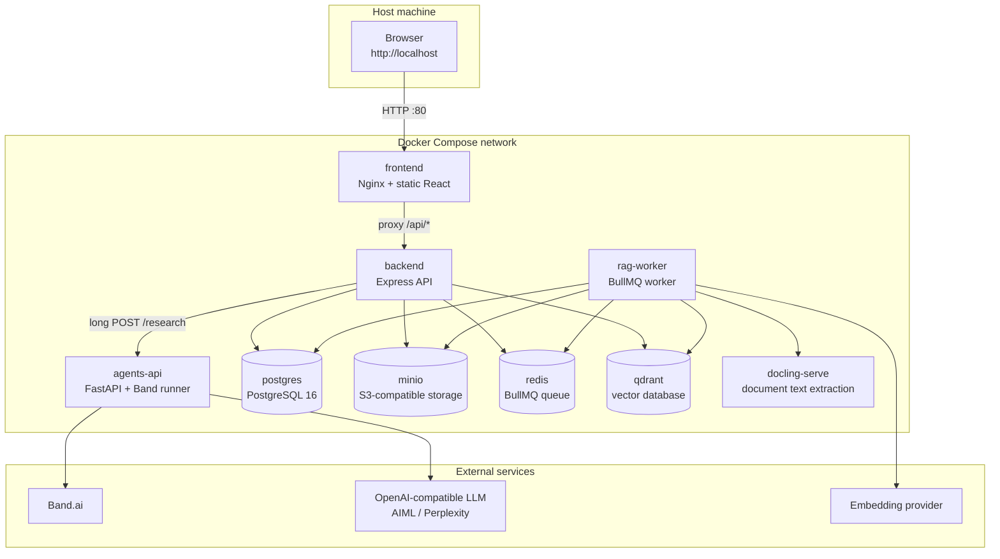
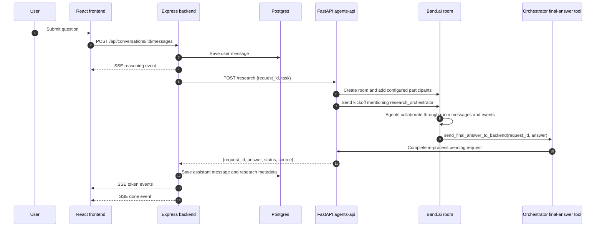
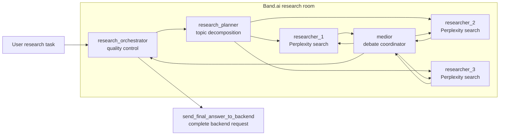
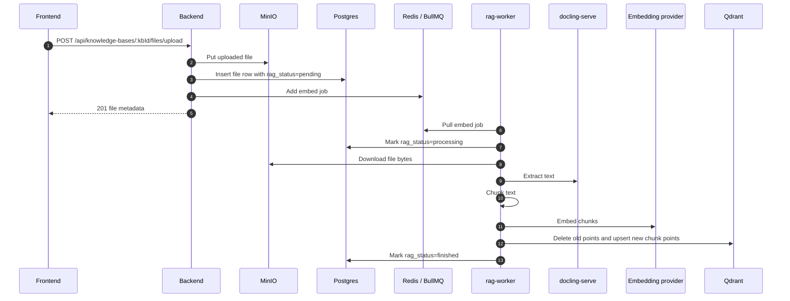
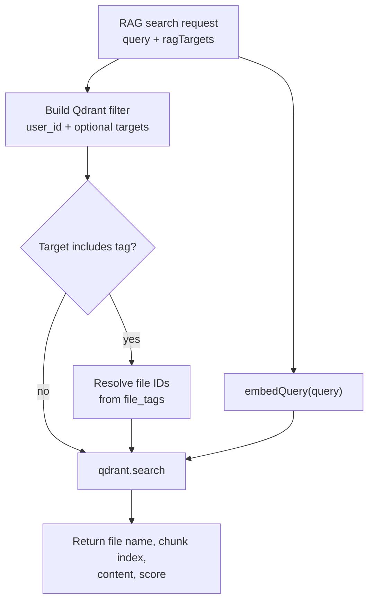
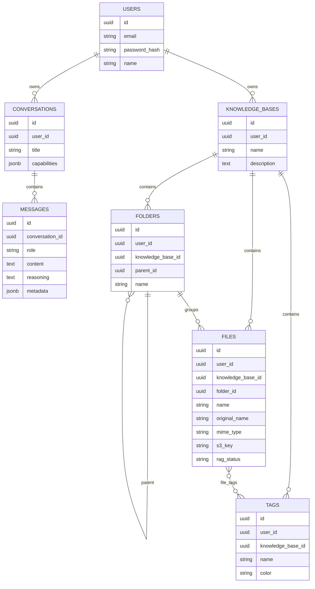

# JointSearch Documentation

## Product Summary

JointSearch is a research workspace for questions that need source-aware,
cross-checked answers. The application combines:

- A React chat interface with conversation history and knowledge-base mentions.
- An Express backend that owns auth, persistence, file management, SSE streaming,
  and calls to the agents service.
- A FastAPI agents service that creates Band.ai rooms and runs the local Band
  agent runtime.
- A RAG worker that converts uploaded documents into vector-searchable chunks.
- A Remotion video project that demonstrates the product flow.

## Repository Layout

```text
.
├── frontend/       React/Vite single-page app served by Nginx
├── backend/        Express API, TypeORM entities, auth, chat, RAG endpoints
├── agents/         FastAPI service, Band.ai client, agent registry, agent roles
├── rag-worker/     BullMQ document ingestion worker
├── video/my-video/ Remotion product explainer video
├── docker-compose.yml
├── .env.example
└── documentation.md
```

## Deployment Topology



Only the `frontend` service publishes a host port in `docker-compose.yml`.
Internal services communicate over Compose DNS names such as `backend`,
`agents-api`, `postgres`, and `qdrant`.

## Runtime Responsibilities

| Component        | Entrypoint                    | Responsibilities                                                                    |
| ---------------- | ----------------------------- | ----------------------------------------------------------------------------------- |
| `frontend`       | `frontend/src/main.tsx`       | Routes, auth context, chat UI, knowledge-base UI, SSE consumption                   |
| `backend`        | `backend/src/index.ts`        | Express routes, database startup, S3 bucket startup, Qdrant collection startup      |
| `agents-api`     | `agents/src/agents/api.py`    | `/health`, `/research`, Band runner lifecycle, room creation, final-answer wait     |
| `rag-worker`     | `rag-worker/src/index.ts`     | BullMQ worker, orphaned file requeue, document extraction, embedding, Qdrant writes |
| `video/my-video` | `video/my-video/src/Root.tsx` | Remotion composition `DeepResearchDemo`                                             |

## Chat And Research Request Flow

The chat endpoint is implemented in `backend/src/routes/conversations.ts`.
It saves the user message, starts an SSE response, sends a long-running
`POST /research` request to the agents API, then streams the returned answer
back to the frontend token by token.



### Important Behavior

- The backend uses `AGENTS_API_URL` and calls `POST /research`.
- The agents service keeps pending research completions in process memory.
  A restart or multi-replica deployment would need durable request completion
  storage before it can safely handle in-flight requests.
- The frontend passes selected RAG mentions as `ragTargets`; the backend stores
  them as message metadata. The current chat path sends only `{request_id, task}`
  to the agents API.

## Band.ai Agent Collaboration

The agents runtime is centered on `agents/src/agents/band/registry.py`.
Agent classes register themselves with `@agent(...)`, and the registry starts
configured Band identities from `agents/agent_config.yaml`.



### Agent Roles

| Agent                   | File                                                     | Role                                                                                                   |
| ----------------------- | -------------------------------------------------------- | ------------------------------------------------------------------------------------------------------ |
| `research_orchestrator` | `agents/src/agents/definitions/research_orchestrator.py` | Delegates the task, accepts the final draft, completes the backend request, and posts the final answer |
| `research_planner`      | `agents/src/agents/definitions/research_planner.py`      | Breaks the task into subtopics and assigns work to researchers                                         |
| `researcher_1..3`       | `agents/src/agents/definitions/researcher.py`            | Research assigned subtopics and report evidence, uncertainty, and limitations                          |
| `medior`                | `agents/src/agents/definitions/medior.py`                | Waits for findings, triggers one debate, synthesizes the answer for the orchestrator                   |

Researchers have a `perplexity_search(query: str)` tool backed by the
OpenAI-compatible client. In the default env examples, `OPENAI_BASE_URL` points
at AIML API and the model is `perplexity/sonar-pro`.

## RAG Ingestion Flow

File uploads are handled by `backend/src/routes/kbFiles.ts`. After the file is
stored in MinIO and recorded in Postgres, the backend enqueues a BullMQ `embed`
job. The RAG worker processes that job asynchronously.



Delete jobs remove points from Qdrant after a file is deleted.

## RAG Retrieval Flow

The backend exposes `POST /api/rag/search`. It embeds the query and searches
Qdrant with a user filter plus optional knowledge-base, file, or tag filters.



## Data Model



## API Surface

| Route group                                   | Purpose                                            |
| --------------------------------------------- | -------------------------------------------------- |
| `POST /api/auth/register`                     | Create account                                     |
| `POST /api/auth/login`                        | Login and return access token                      |
| `POST /api/auth/refresh`                      | Refresh access token from refresh cookie           |
| `GET /api/auth/me`                            | Return current user                                |
| `GET/POST /api/conversations`                 | List or create conversations                       |
| `GET/PATCH/DELETE /api/conversations/:id`     | Manage one conversation                            |
| `GET /api/conversations/:id/messages`         | List messages                                      |
| `POST /api/conversations/:id/messages`        | Send a chat message and stream the answer over SSE |
| `GET /api/search`                             | Search conversations/messages                      |
| `GET/POST /api/knowledge-bases`               | Knowledge-base management                          |
| `GET/POST /api/knowledge-bases/:kbId/folders` | Folder management                                  |
| `GET/POST /api/knowledge-bases/:kbId/files`   | File listing and upload                            |
| `GET/POST /api/knowledge-bases/:kbId/tags`    | Tag management                                     |
| `GET /api/mentions`                           | Mention lookup for KBs, files, and tags            |
| `POST /api/rag/search`                        | Vector search over embedded file chunks            |
| `GET /api/health`                             | Backend health                                     |

Agents API:

| Route            | Purpose                                                      |
| ---------------- | ------------------------------------------------------------ |
| `GET /health`    | Agents service health                                        |
| `POST /research` | Create a Band.ai research room and wait for the final answer |

## Configuration

Root `.env` is used by Docker Compose. Start with:

```bash
cp .env.example .env
```

Required configuration groups:

| Group      | Variables                                                                                                                                                           |
| ---------- | ------------------------------------------------------------------------------------------------------------------------------------------------------------------- |
| Postgres   | `POSTGRES_USER`, `POSTGRES_PASSWORD`, `POSTGRES_DB`, `POSTGRES_HOST`, `POSTGRES_PORT`                                                                               |
| MinIO      | `MINIO_ROOT_USER`, `MINIO_ROOT_PASSWORD`, `MINIO_BUCKET`, `S3_ENDPOINT`, `S3_REGION`                                                                                |
| Redis      | `REDIS_HOST`, `REDIS_PORT`                                                                                                                                          |
| Qdrant     | `QDRANT_HOST`, `QDRANT_PORT`                                                                                                                                        |
| Docling    | `DOCLING_SERVE_URL`                                                                                                                                                 |
| Agents     | `AGENTS_API_URL`, `AGENTS_RESEARCH_TIMEOUT_SECONDS`, `BAND_REST_URL`, `BAND_WS_URL`, `BAND_AGENT_API_KEY`, `BAND_AGENT_API_ID`, `OPENAI_BASE_URL`, `OPENAI_API_KEY` |
| Embeddings | `EMBEDDING_API_KEY`, `EMBEDDING_BASE_URL`, `EMBEDDING_MODEL`, `EMBEDDING_DIMS`                                                                                      |
| Auth       | `JWT_SECRET`, `JWT_REFRESH_SECRET`, `JWT_EXPIRY`, `JWT_REFRESH_EXPIRY`                                                                                              |
| Backend    | `MAX_FILE_SIZE`, `NODE_ENV`, `PORT`                                                                                                                                 |

The agents service also needs `agents/agent_config.yaml`. Create it from:

```bash
cp agents/agent_config.example.yaml agents/agent_config.yaml
```

That file is bind-mounted into the `agents-api` container and should not be
committed with real credentials.

## Remotion Video

The product demo lives in `video/my-video`. It renders the `DeepResearchDemo`
composition at `1920x1080`, `30fps`. The current scene sequence is:

```mermaid
gantt
  title DeepResearchDemo scene timeline
  dateFormat X
  axisFormat %s
  section Scenes
  Intro problem framing        :0, 450
  Landing page                 :450, 270
  Login                        :720, 150
  Query input and thinking     :870, 240
  Agent architecture           :1110, 570
  Band.ai cross-check          :1680, 360
  Synthesis                    :2040, 330
  Final chat answer            :2370, 210
  JointSearch star close       :2580, 180
```



Run it with:

```bash
cd video/my-video
npm install
npm run dev
```

The previous voiceover audio has been removed; the public folder currently keeps
script text only.

## Operational Notes

- `agents-api` starts the Band agent runner in the same FastAPI process.
- `backend` depends on a healthy `agents-api` service in Docker Compose.
- `agents-api` is internal-only; callers inside Compose use
  `http://agents-api:8001`.
- The current agents completion store is process-local memory. Do not run
  multiple agents API replicas without replacing that store.
- The RAG worker retries failed jobs through BullMQ and marks files as `failed`
  after the configured attempts are exhausted.

## Quality Gates

```bash
# Root Docker configuration
docker compose config

# Backend
cd backend
npm run build
npm run lint

# Frontend
cd frontend
npm run build
npm run lint

# RAG worker
cd rag-worker
npm run build

# Agents
cd agents
uv run ruff format --check .
uv run ruff check .
uv run pyright .
uv run pytest

# Video
cd video/my-video
npm run lint
```
