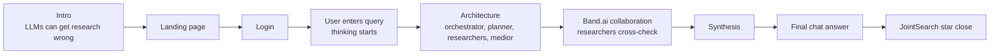

# JointSearch Remotion Video

This package contains the `DeepResearchDemo` Remotion composition for the
JointSearch product walkthrough.

The video is code-rendered with React, Remotion, Tailwind, lucide icons, and a
small set of local UI components. It currently has no audio track; script text is
stored under `public/scripts/`.

## Composition



## Timeline

```mermaid
gantt
  title DeepResearchDemo timeline at 30fps
  dateFormat X
  axisFormat %s
  section Scenes
  Intro                 :0, 450
  Landing               :450, 270
  Login                 :720, 150
  Query and thinking    :870, 240
  Architecture          :1110, 570
  Cross-check           :1680, 360
  Synthesis             :2040, 330
  Answer                :2370, 210
  Final                 :2580, 180
```



## Important Files

| File                                     | Purpose                                                              |
| ---------------------------------------- | -------------------------------------------------------------------- |
| `src/Root.tsx`                           | Registers the `DeepResearchDemo` composition at `1920x1080`, `30fps` |
| `src/Composition.tsx`                    | Scene ordering, durations, shared scene transition                   |
| `src/components/NodeGraphBackground.tsx` | Animated graph background used across scenes                         |
| `src/scenes/*.tsx`                       | Individual scenes                                                    |
| `public/scripts/*.md`                    | Per-scene voiceover/script text                                      |

## Commands

Install dependencies:

```bash
npm install
```

Start Remotion Studio:

```bash
npm run dev
```

Open:

```text
http://localhost:3000/DeepResearchDemo
```

Render the video:

```bash
npx remotion render DeepResearchDemo
```

Run checks:

```bash
npm run lint
```

## Notes

- Remotion Studio may show the preview scaled down in `Fit` mode. The rendered
  composition remains `1920x1080`.
- The public voiceover audio has been removed. Add audio explicitly in
  `src/Composition.tsx` if a generated voiceover is needed again.
