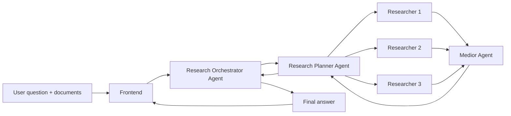

# DeepResearch Hackathon Video Script

## Video Goal

Create a clear hackathon submission video that explains the product, the user
flow, and the multi-agent research architecture behind DeepResearch.

Target length: 90-105 seconds  
Format: 16:9, 1920x1080  
Frame rate: 30fps  
Approximate total duration: 98 seconds / 2940 frames

## Core Message

DeepResearch turns a complex question and supporting documents into a coordinated
research workflow. Instead of relying on a single AI response, it uses multiple
agents to plan, research, debate, cross-check, and synthesize a better answer.

## Full Voiceover Script

Most AI tools can answer quickly. But when a question is complex, speed is not
enough. You need coverage, evidence, and a way to catch contradictions before
the answer reaches you.

DeepResearch is a chat-based platform for deep research and fact-checking. The
user asks a question and attaches required documents: reports, PDFs, notes,
datasets, or internal knowledge.

Then the Research Orchestrator Agent takes over. It receives the request, tracks
the task, and delegates topic decomposition to the Research Planner Agent.

The planner turns one broad question into focused subtopics. It defines what
each part should investigate, why it matters, and which researcher should own it.

Multiple researcher agents then work in parallel. Each researcher investigates a
specific angle, searches for evidence, reads the uploaded documents, and
separates confirmed facts from uncertainty.

Next, the Medior Agent coordinates cross-checking. Researchers compare findings,
challenge weak claims, and surface conflicts, missing sources, and limitations.

The Medior synthesis goes back to the planner, which drafts a structured answer.
The orchestrator reviews it for completeness, factual support, source coverage,
uncertainty, and directness. If needed, it asks for one revision pass.

When the answer is ready, the orchestrator sends it back to the frontend as a
clear report with findings, evidence, risks, and next steps.

DeepResearch is not just another AI answer. It is a research process: planned,
distributed, cross-checked, and synthesized.

Deep research should not feel like searching alone. It should feel like having a
research team working with you.

## Scene Plan for Remotion

Use one Remotion `Composition` for the full video and separate each section into
timed `Sequence` components. The scene durations below assume 30fps.

| Scene | Time | Frames | Visual Plan | Voiceover |
| --- | ---: | ---: | --- | --- |
| 1. Cold Open | 0:00-0:07 | 0-209 | Fast cuts of browser tabs, PDFs, notes, and highlighted contradictions. End on a blank search box. | "Most AI tools can answer quickly. But when a question is complex, speed is not enough." |
| 2. Problem | 0:07-0:15 | 210-449 | Split screen: "Quick answer" on one side, "Trusted research" on the other. Show evidence, uncertainty, and contradiction chips. | "You need coverage, evidence, and a way to catch contradictions before the answer reaches you." |
| 3. Product Intro | 0:15-0:24 | 450-719 | Show DeepResearch logo/title over the chat interface. Animate the app name in with a subtle scale/fade. | "DeepResearch is a chat-based platform for deep research and fact-checking. The user asks a question and attaches required documents." |
| 4. User Input | 0:24-0:34 | 720-1019 | User types a research question and attaches files. Show document cards: "market-report.pdf", "internal-notes.md", "dataset.csv". | "Reports, PDFs, notes, datasets, or internal knowledge." |
| 5. Orchestrator | 0:34-0:44 | 1020-1319 | Architecture diagram begins. Frontend request flows into "Research Orchestrator Agent". | "Then the Research Orchestrator Agent takes over. It receives the request, tracks the task, and delegates topic decomposition to the Research Planner Agent." |
| 6. Planner | 0:44-0:56 | 1320-1679 | Orchestrator connects to "Research Planner Agent". The question splits into subtopic cards and assignment chips. | "The planner turns one broad question into focused subtopics. It defines what each part should investigate, why it matters, and which researcher should own it." |
| 7. Parallel Researchers | 0:56-1:08 | 1680-2039 | Three researcher nodes work in parallel. Search snippets, uploaded docs, and notes flow into each node. | "Multiple researcher agents then work in parallel. Each researcher investigates a specific angle, searches for evidence, reads the uploaded documents, and separates confirmed facts from uncertainty." |
| 8. Cross-checking | 1:08-1:20 | 2040-2399 | Researcher outputs flow into "Medior Agent". Show conflict markers, evidence checks, and gap cards being resolved. | "Next, the Medior Agent coordinates cross-checking. Researchers compare findings, challenge weak claims, and surface conflicts, missing sources, and limitations." |
| 9. Synthesis + Review | 1:20-1:31 | 2400-2729 | Medior summary flows back to Planner, then Orchestrator. A quality checklist appears beside a draft report. | "The Medior synthesis goes back to the planner, which drafts a structured answer. The orchestrator reviews it for completeness, factual support, source coverage, uncertainty, and directness." |
| 10. Final Answer + Close | 1:31-1:38 | 2730-2939 | Final report lands in the frontend. End on logo, tagline, and simplified architecture in the background. | "When the answer is ready, it returns to the frontend as a clear report. DeepResearch is not just another AI answer. It is a research process: planned, distributed, cross-checked, and synthesized." |

## Suggested Remotion Component Structure

```txt
src/
  Root.tsx
  DeepResearchHackathonVideo.tsx
  scenes/
    ColdOpen.tsx
    ProblemScene.tsx
    ProductIntro.tsx
    UserInputScene.tsx
    OrchestratorScene.tsx
    PlannerScene.tsx
    ResearchersScene.tsx
    CrossCheckScene.tsx
    SynthesisScene.tsx
    FinalAnswerScene.tsx
```

## Remotion Implementation Notes

- Register the video as a single `Composition` with `durationInFrames={2940}`,
  `fps={30}`, `width={1920}`, and `height={1080}`.
- Use `Sequence` for each scene so timing stays explicit and easy to edit.
- Use `AbsoluteFill` for full-screen scene layouts.
- Use `interpolate`, `spring`, and opacity/transform animations for node
  entrances, document flow, checklist reveals, and final report assembly.
- Keep the UI dense and realistic: this should feel like a working research
  product, not a generic landing page.
- Use the same architecture language throughout:
  `Frontend -> Research Orchestrator -> Research Planner -> Researcher Agents -> Medior -> Planner -> Orchestrator -> Frontend`.

## Remotion Reference Links

- Remotion homepage: <https://www.remotion.dev/>
- Composition docs: <https://www.remotion.dev/docs/composition>
- Sequence docs: <https://www.remotion.dev/docs/sequence>
- Fundamentals: <https://www.remotion.dev/docs/the-fundamentals>

## On-screen Text Suggestions

- "Complex questions need more than fast answers."
- "Upload documents. Ask a question. Start deep research."
- "Planner decomposes the task."
- "Researchers investigate in parallel."
- "Medior coordinates debate and cross-checking."
- "Orchestrator reviews quality and returns the final answer."
- "Planned. Distributed. Cross-checked. Synthesized."

## Visual Style

- Background: dark neutral or very light neutral, depending on the current app
  UI direction.
- Accent color: one strong product accent for active agents and data flow.
- Motion style: fast but readable, with clear cause-and-effect transitions.
- Avoid decorative visuals that do not explain the workflow. The architecture is
  the story.

## Optional Architecture Diagram



## Shorter 60-second Cut

If the submission requires a shorter video, remove scene 2, compress the
cross-checking and synthesis sections, and keep the core sequence:

1. User asks a question and uploads documents.
2. Orchestrator receives the task.
3. Planner breaks it into subtopics.
4. Researchers work in parallel.
5. Medior coordinates debate and cross-checking.
6. Orchestrator returns the final answer.
